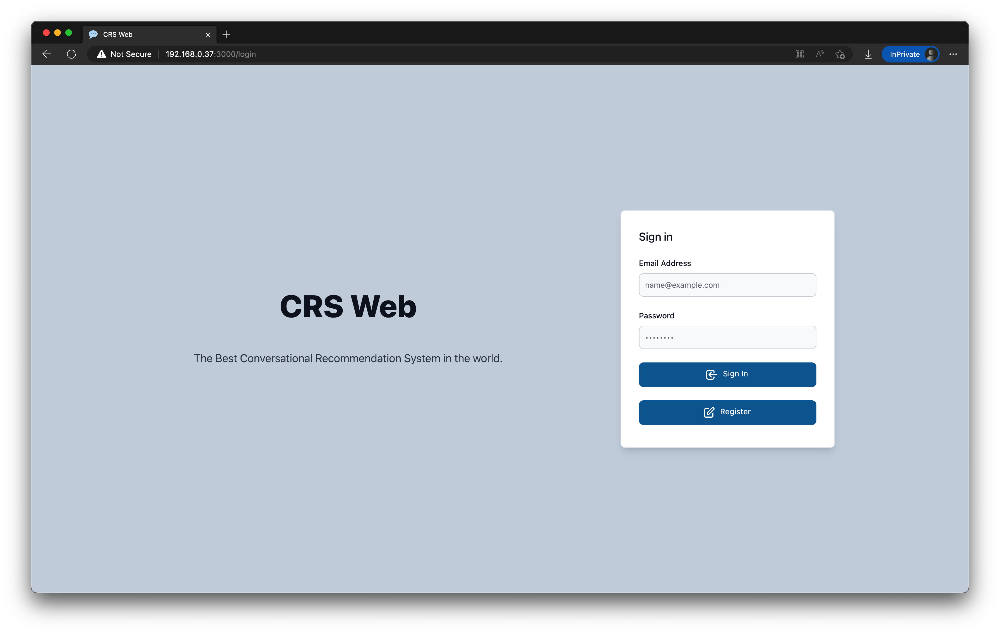
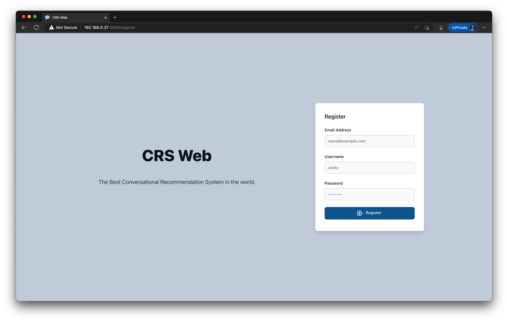
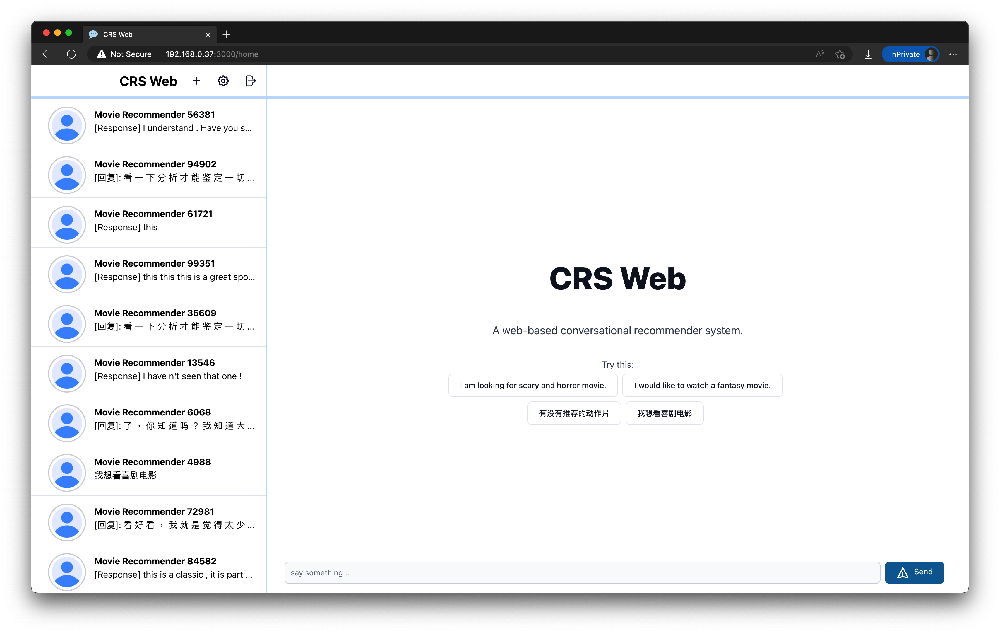
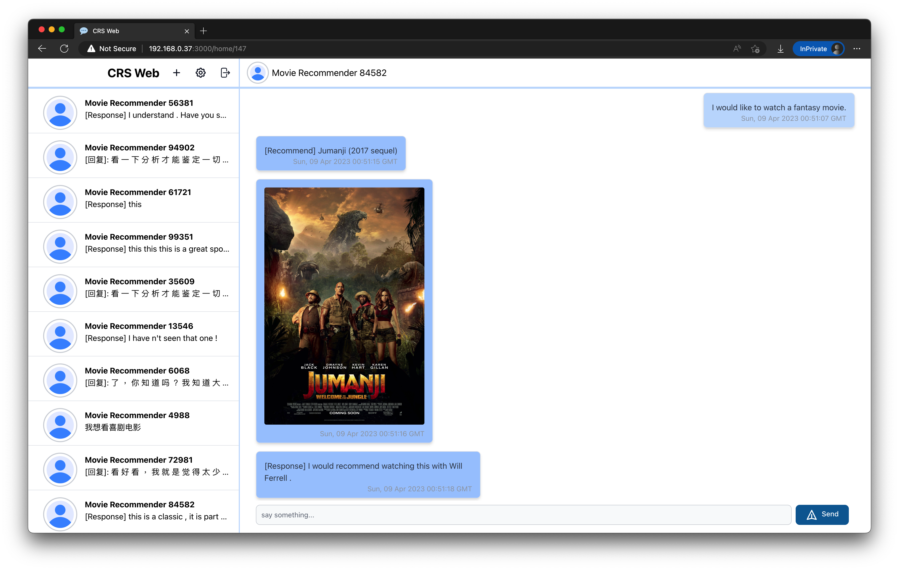
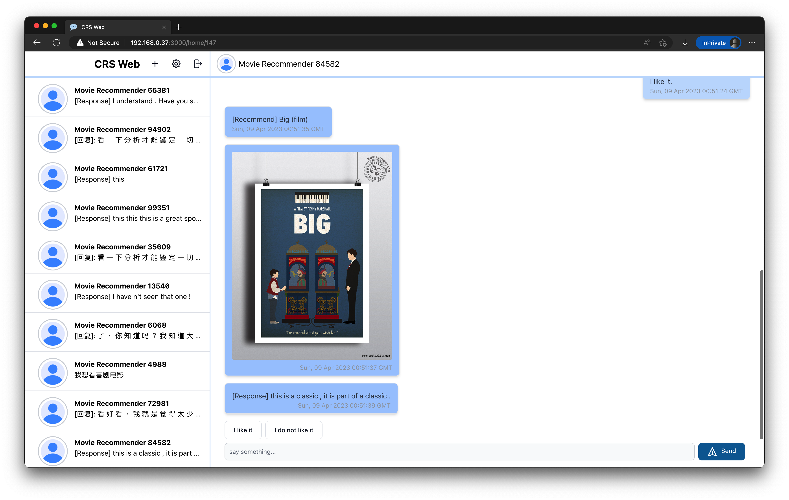
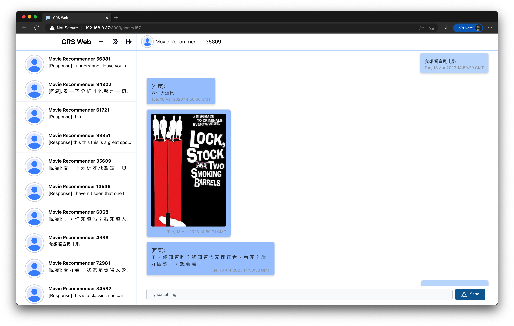
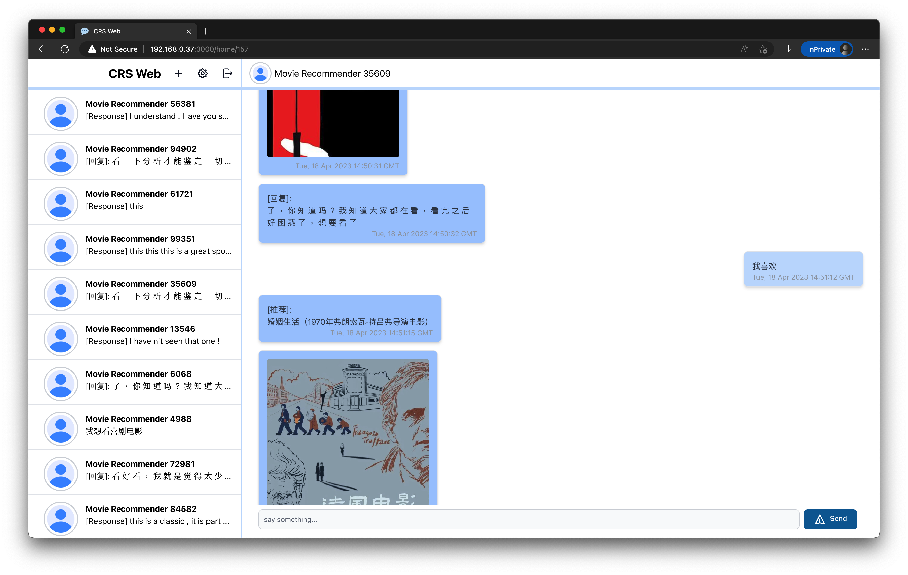
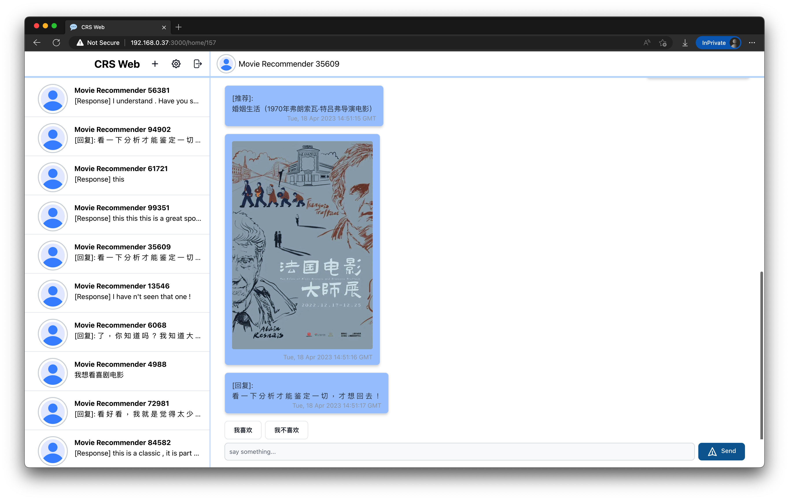

    <h1>💬 CRS Web </h1>
    

        CRS Web is a web-based conversational recommender system that allows AI recommender to recommend movies in a short conversation based on user's preference.
    

    

## Features
This project aims to provide a easy-to-use interface for users to access the conversational recommender and ask for movie recommendaation. 

The features included in this projects are:

- AI-based conversational recommender for movie recommendation
- Multilingual support for English and Chinese languages
- Movie poster display based on movie keywords
- Simple user login and registration functionality
- Creation of new conversations and viewing of past conversations.

To support certain features, this project uses a modified version of CRSLab to perform tasks and communicate with the web application.

## Screenshots

- Login Page

- Register Page

- Conversation Page

- Conversation Page with English conversation example

- Conversation Page with Chinese conversation example

## Setup
1. Install Docker, Python, PIP, NodeJS and Conda
2. To run the fronend, start a new terminal and run `cd frontend && yarn && yarn start`
3. To run the backend, start a new terminal and run `cd backend && pipenv install && pipenv run python app.py`
4. To run the MySQL database, start a new terminal and run `cd mysql && docker-compose up`
5. To run the conversational recommender module, follow CRSLab's readme instruction inside the `CRSLab` folder.

## Learn More
This project is the Final Year Project of the 

The following tech is used in this project: 
- ReactJS - Frontend framework of this project
- TailwindCSS - Utility-first CSS framework for styling
- Flowbite - UI components library based on TailwindCSS
- Python Flask - Backend framework of this project
- MySQL - Database of this project
- Docker - Container platform for running MySQL
- CRSLab - Open-source toolkit for building Conversational Recommender System
